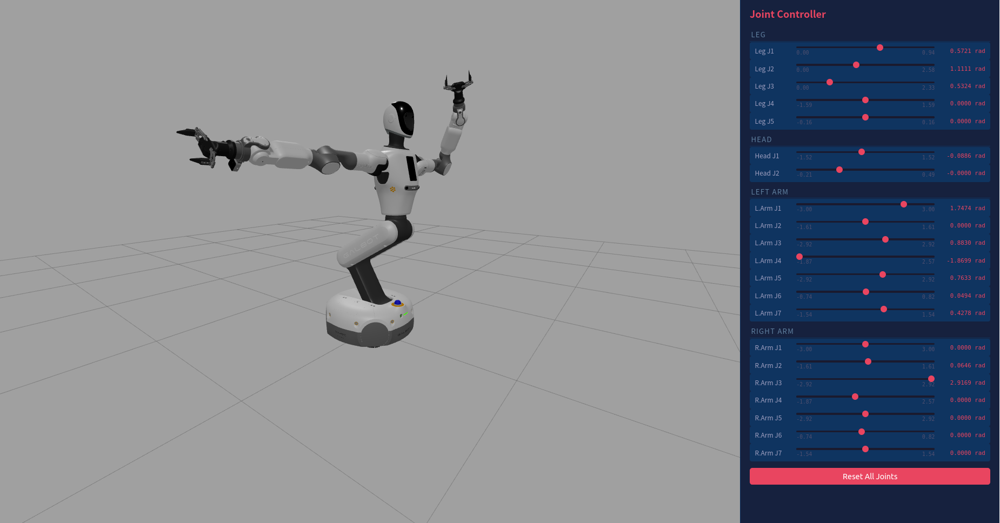
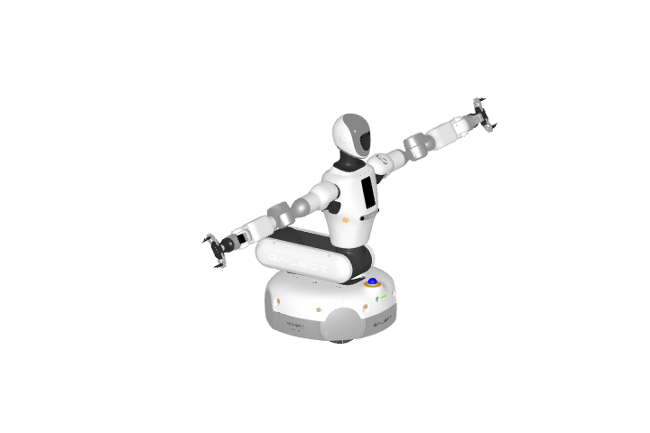
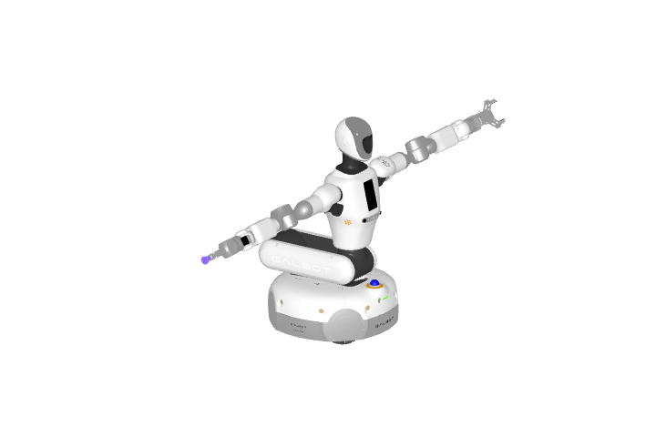
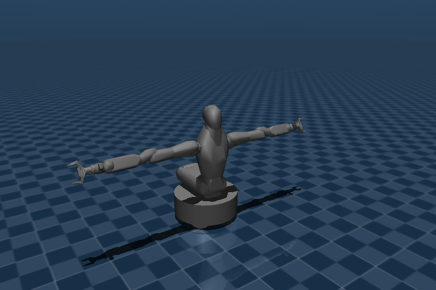

# Galbot G1 Web Visualization

## Quick Start
```sh
git clone https://github.com/jiayou/galbot_one_golf_description.git
cd galbot_one_golf_description
# git checkout webviz
git lfs pull
python3 -m http.server
```

Open http://localhost:8000/web in browser


Or, use quick view:
http://localhost:8000/web/quick_view.html?joint=1,2,1,0,0

## Integrate into your project

```html
<iframe id="viewer" src="http://your-server/web/galbot_g1.html" style="width: 400px; height: 500px;"></iframe>
```

```js
const viewer = document.getElementById('viewer');
viewer.onload = function() {
  viewer.contentWindow.postMessage({
    type: "setJoints",
    joints: {
      "leg_joint1": 1.0,
      "leg_joint2": 2.0,
      "leg_joint3": 1.0,
      //...
    } 
  }, "*");
}

```

# Galbot One Golf Description


ROS 2 description package for Galbot One Golf, including URDF descriptions and MJCF/USD models.

## Build

```bash
colcon build --packages-select galbot_one_golf_description --symlink-install
source install/setup.bash
```

## Git LFS

This package is usable as a minimal ROS 2 URDF description package without Git
LFS. The URDF, xacro, launch/config files, and meshes referenced by URDF are
stored in regular Git.

Install Git LFS only when you need the optional full MJCF/USD assets:

```bash
git lfs install
git lfs pull
```

LFS currently tracks binary assets under `mjcf/meshes/` (`.obj`, `.stl`,
`.png`) and `usd/configuration/galbot_one_golf_base.usdc`. Source description files such as `.urdf`,
`.xacro`, `.usda`, `.xml`, `.py`, and `.md` remain regular Git files.

## Display

```bash
ros2 launch galbot_one_golf_description display.launch.py
ros2 launch galbot_one_golf_description display.launch.py left_ee_type:=hitbot right_ee_type:=suction_cup
ros2 launch galbot_one_golf_description display.launch.py type:=left_arm
ros2 launch galbot_one_golf_description display.launch.py type:=omni_chassis
```

The `type` argument defaults to `full`. Component display types include
`omni_chassis`, `omniwheel`, `leg`, `torso`, `head`, `left_arm`, `right_arm`,
`galbot_gripper`, `hitbot_gripper`, `suction_cup`, and `wrist_camera`.

## URDF

Preset URDF files:

- `urdf/galbot_one_golf.urdf`
- `urdf/galbot_one_golf_fixed_base.urdf`
- `urdf/galbot_one_golf_left_hitbot_gripper_right_suction_cup.urdf`

`galbot_one_golf.urdf` keeps the full visual model and exposes the four main
wheel joints as continuous joints. `galbot_one_golf_fixed_base.urdf` keeps the
same visual model but fixes the wheel joints for display, planning, and
fixed-base conversion workflows. Passive omni-wheel roller joints are omitted
from preset URDFs to keep the assets compact.

Generate another URDF from xacro:

```bash
python3 scripts/create_description.py --left-ee-type hitbot --right-ee-type suction_cup
```

Generate an individual component URDF directly from xacro:

```bash
xacro xacro/component.xacro type:=omni_chassis > omni_chassis.urdf
xacro xacro/component.xacro type:=omniwheel > omniwheel_10.urdf
xacro xacro/component.xacro type:=left_arm > left_arm.urdf
xacro xacro/component.xacro type:=wrist_camera arm_camera:=d405 > wrist_camera.urdf
xacro xacro/components/right_arm.xacro > right_arm.urdf
xacro xacro/components/omniwheel_10.xacro omniwheel_standalone:=true > omniwheel_10.urdf
```

| Default URDF model | Hitbot + suction cup URDF model |
| --- | --- |
|  |  |

## MJCF

MJCF files are generated with `urdf-to-mjcf`. See
[docs/mjcf.md](docs/mjcf.md) for the exact regeneration commands and variant
notes.

MJCF base variants:

- `mjcf/galbot_one_golf.xml`: wheeled base, with `wheel1_joint` through
  `wheel4_joint` velocity actuators.
- `mjcf/galbot_one_golf_fixed_base.xml`: fixed base, with no base or wheel drive
  joints.
- `mjcf/galbot_one_golf_planar_base.xml`: virtual planar base, with
  `base_x_joint`, `base_y_joint`, and `base_yaw_joint` velocity actuators.
- `mjcf/galbot_one_golf_floating_base.xml`: MuJoCo freejoint base, with no base
  actuator.

| MJCF visual model | MJCF collision-only model |
| --- | --- |
|  |  |

## USD

The main USD entry point is `usd/galbot_one_golf.usda`. It keeps the public
composition small and payloads the larger robot layers from `usd/configuration/`:

- `usd/configuration/galbot_one_golf_base.usdc`: base robot hierarchy and core composition
- `usd/configuration/galbot_one_golf_physics.usda`: physics and PhysX data
- `usd/configuration/galbot_one_golf_sensor.usda`: sensor payloads
- `usd/configuration/galbot_one_golf_robot.usda`: robot integration payloads
- `usd/envs/empty.usda`: example scene that references the main asset

Only the base layer is stored as USDC; editable layers are kept as USDA.

## Package Layout

- `xacro/`: source robot descriptions
- `urdf/`: preset and generated URDF files
- `mjcf/`: MuJoCo mjcf models
- `usd/`: USD models
- `meshes/`: visual and collision meshes
- `launch/`: display launch files
- `config/`: configuration files
- `scripts/`: helper scripts

## LICENSE

This software is licensed under the Apache License 2.0. See `LICENSE` for details.
